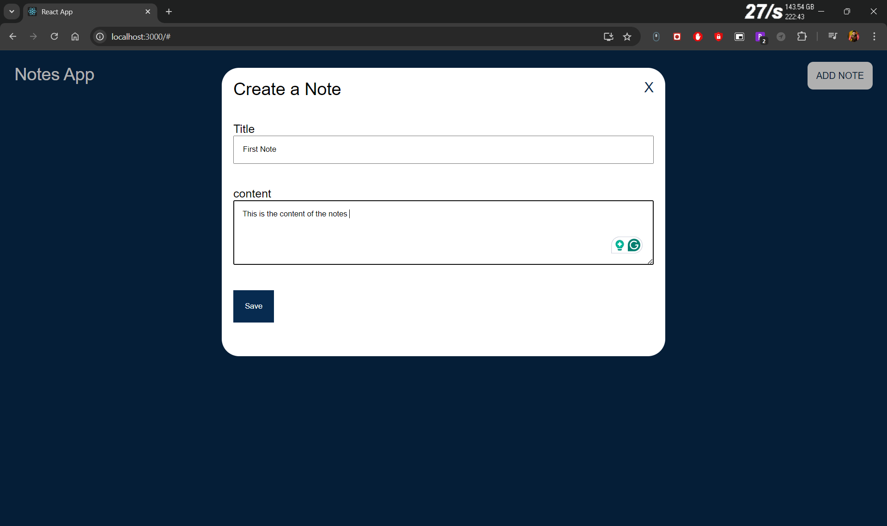

# Notes App

## Overview

The **Notes App** is a web application that allows users to create, view, and delete notes. The application is built with a Django backend and a React frontend, making it a full-stack web application. The backend handles API requests and manages the data, while the frontend provides an interactive user interface.

## Features

- **Create Notes:** Users can add a new note by providing a title and content.
- **View Notes:** All the notes created by the user are displayed in a list format.
- **Delete Notes:** Users can delete a note by clicking on the "X" button on the note.

## Technologies Used

### Backend
- **Django**: A high-level Python web framework that encourages rapid development.
- **Django REST Framework (DRF)**: Used for creating a RESTful API to handle the notes.
- **SQLite**: A lightweight database for storing notes.

### Frontend
- **React**: A JavaScript library for building user interfaces.
- **CSS**: Used for styling the frontend components.

## Project Structure

```plaintext
Notes_App/
│
├── notes_api/
│   ├── api/
│   │   ├── __init__.py
│   │   ├── asgi.py
│   │   ├── settings.py
│   │   ├── urls.py
│   │   └── wsgi.py
│   ├── env/
│   ├── notes/
│   │   ├── __init__.py
│   │   ├── admin.py
│   │   ├── apps.py
│   │   ├── models.py
│   │   ├── serializers.py
│   │   ├── tests.py
│   │   └── views.py
│   ├── db.sqlite3
│   └── manage.py
│   └── requirements.txt
│
└── notes_client/
    ├── node_modules/
    ├── public/
    ├── src/
    │   ├── components/
    │   │   └── note.js
    │   ├── styles/
    │   │   └── main.css
    │   └── index.js
    ├── .gitignore
    ├── package-lock.json
    ├── package.json
    └── README.md
```

## Setup Instructions

### Backend (Django)

1. **Clone the repository**:
   ```bash
   git clone https://github.com/shubhamnarkhede/Notes_App.git
   cd Notes_App/notes_api
   ```

2. **Create a virtual environment and activate it**:
   ```bash
   python -m venv env
   source env/Scripts/activate 
   ```

3. **Install dependencies**:
   ```bash
   pip install -r requirements.txt
   ```

4. **Run migrations**:
   ```bash
   python manage.py migrate
   ```

5. **Run the server**:
   ```bash
   python manage.py runserver
   ```

### Frontend (React)

1. **Navigate to the frontend directory**:
   ```bash
   cd ../notes_client
   ```

2. **Install dependencies**:
   ```bash
   npm install
   ```

3. **Start the React development server**:
   ```bash
   npm start
   ```

### Access the Application

- **Backend**: The Django server will be running on `http://localhost:8000`.
- **Frontend**: The React development server will be running on `http://localhost:3000`.

### API Endpoints

- `GET /posts/`: Retrieve all notes.
- `POST /posts/`: Create a new note.
- `DELETE /posts/{id}/`: Delete a note by its ID.

### Swagger Documentation

- Access the Swagger UI for API documentation at `http://localhost:8000/swagger/`.


## Screenshots

1. **Main Page**: 
   

2. **Note Popup**:
   

3. **Add Text to Note**:
   

4. **Notes Displayed on Main Page**:
   

5. **Create Second Note**:
   

6. **Notes Displayed on Main Page**:
   

7. **Delete First Note**:
   

8. **All Notes Deleted**:
   


## Conclusion

This Notes App is a implementation of a full-stack web application, demonstrating how to use Django for the backend and React for the frontend. It is a useful starting point for building more complex applications.


---
